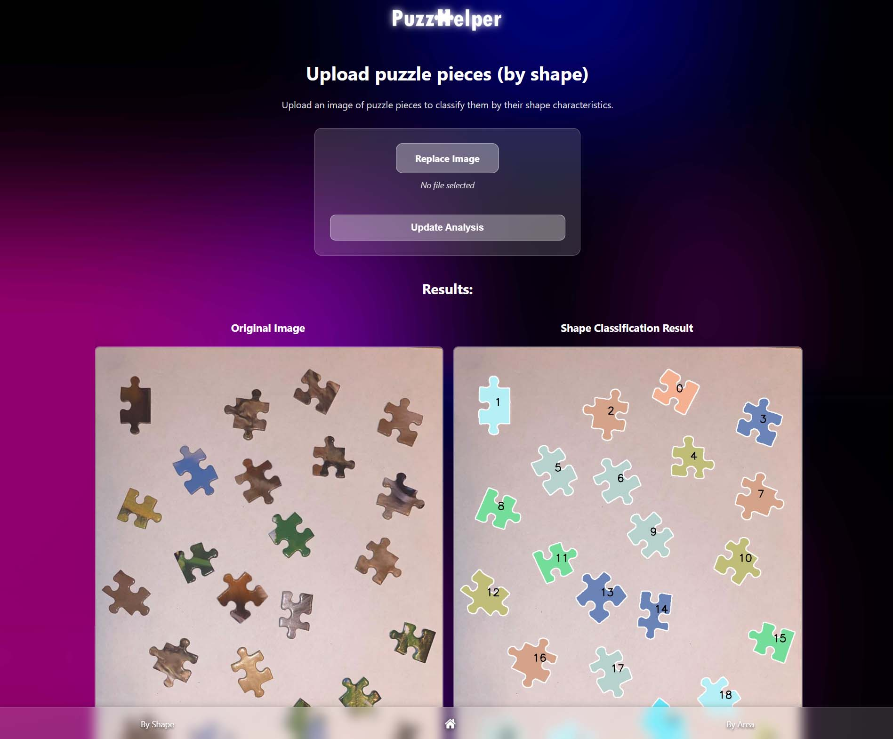
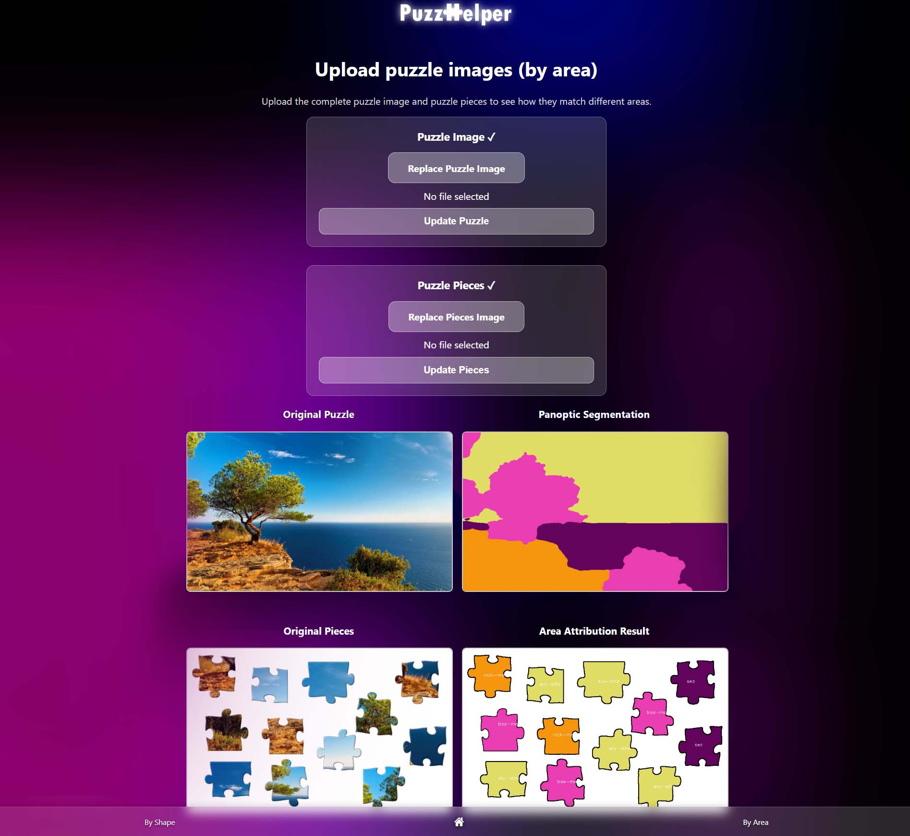
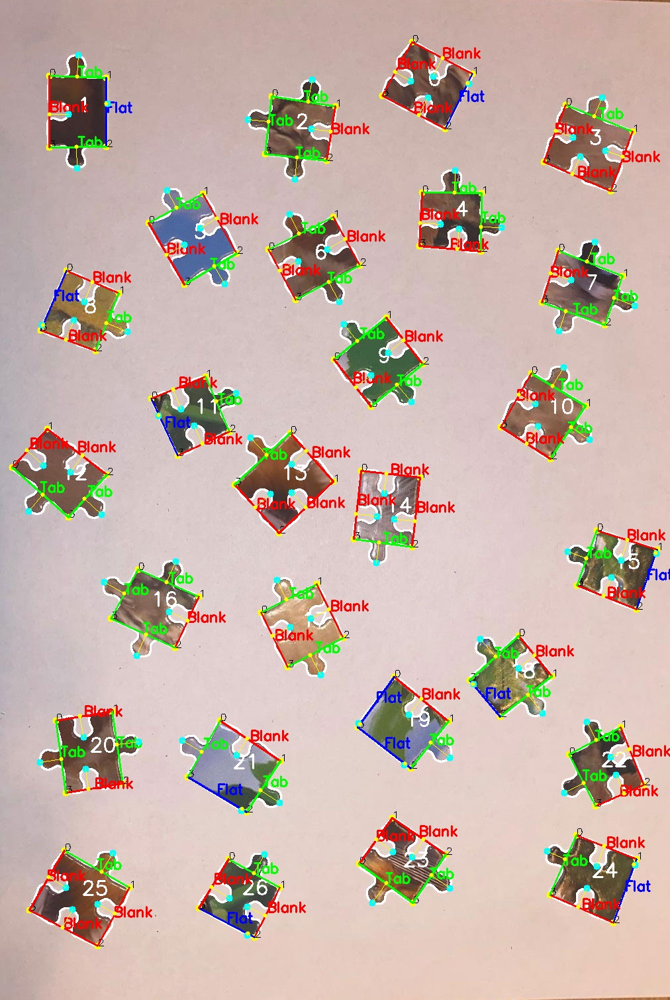

<p align="center">
  
</p>

A web application that lets you classify jigsaw puzzle pieces either by their geometric shape (tabs/blanks/flats) or by matching each piece to a colored region in the reference image using state-of-the-art panoptic segmentation (Mask2Former) and OpenAI vision reasoning.

---

## Key Features

| Feature                    | Description                                                                                                                                                          |
| -------------------------- | -------------------------------------------------------------------------------------------------------------------------------------------------------------------- |
| **By Shape**               | Detects each piece, finds its 4 corners, classifies every edge (Tab / Blank / Flat), and groups pieces with identical edge signatures.                               |
| **By Area**                | Upload the finished puzzle image once → panoptic segmentation → precise colour + texture + OpenAI matching paints each loose piece with the exact RGB of its region. |
| **Screenshot Generator**   | Saves visualisations for contours, edge classes, corner detection, and area attribution into the `results/` folder.                                                  |
| **REST-like Flask routes** | `/by_shape` and `/by_area` templates with drag-and-drop file upload, live status, and cached panoptic data.                                                          |
| **Modular pipeline**       | Separate modules: `panoptic_segmentation.py`, `identify_piece_shapes.py`, `puzzle_area_match.py`, `detect_corner_simple.py`, `find_contour.py`, etc.                 |

---

## Project Structure

```
final/
├── app.py                     # Flask entry-point
├── config.py                  # OPENAI_API_KEY and config (not committed)
├── requirements.txt           # Python dependencies
├── .gitignore                 # Exclusion rules
├── templates/                 # HTML (Jinja2) templates
│   ├── welcome.html           # Landing screen with video background
│   ├── select_method.html     # Choose shape/area classification
│   ├── by_shape.html          # Upload puzzle pieces for shape-based grouping
│   └── by_area.html           # Upload full puzzle + pieces for region matching
├── static/                    # CSS, logo, video background
│   ├── style.css
│   ├── logowhite.png
│   ├── PuzzleVideo.mp4
│   └── screenshots/           # Example screenshots for documentation
│       ├── by_shape.jpg
│       ├── by_area.jpg
│       └── edge_classification_result.jpg
├── uploads/                   # Temp upload dir (git-ignored)
├── results/                   # Result images and metadata (git-ignored)
├── detect_corner_simple.py    # Finds 4 corners per piece
├── identify_piece_shapes.py   # Edge classification logic
├── puzzle_area_match.py       # Matching logic (color + texture + OpenAI)
├── panoptic_segmentation.py   # Uses Mask2Former to segment full puzzle
├── find_contour.py            # Detects individual puzzle pieces using contour extraction
└── .env (optional)            # For storing OPENAI_API_KEY securely
```

---

## Setup

```bash
# 1. Clone
$ git clone https://github.com/<your-org>/puzzle-project.git
$ cd puzzle-project

# 2. Create venv (optional but recommended)
$ python -m venv .venv
$ source .venv/bin/activate  # Windows: .venv\Scripts\activate

# 3. Install requirements
$ pip install -r requirements.txt

# 4. Environment variables
$ export OPENAI_API_KEY=<your-key>
# or create a .env file or edit config.py

# 5. Launch
$ python app.py
```

Server runs at [http://localhost:5000](http://localhost:5000). Navigate to `/select` to choose workflow.

---

## Usage Overview

### 1. `/by_shape` – Shape Classification

* Upload an image of puzzle pieces on a plain background
* Each piece is analyzed using:

  * Corner detection
  * 4 edge contour segments
  * Edge deviation and orientation logic
* Result:

  * Classification of each edge as `Tab`, `Blank`, or `Flat`
  * Grouping by shape signature (rotation-invariant)
  * Saves: `shape_result.jpg`, `edge_classification_result.jpg`, `corners_result.jpg`

### 2. `/by_area` – Region Matching by Panoptic Segmentation

* Upload full puzzle image first → processed once with Mask2Former (COCO model)
* Then upload puzzle pieces
* Each piece is matched to a puzzle region using:

  * Color similarity (average RGB)
  * Texture similarity (SSIM)
  * GPT-4o (image-to-image visual reasoning)
* Result image shows each piece painted with the exact region color from the full puzzle.
* Saves: `panoptic_output.png`, `pieces_attributed.png`, `matches_<session>.json`

---

## Screenshots

### Shape Classification Interface

This screen allows uploading puzzle pieces for shape-based analysis.



---

### Area Classification Interface

This screen allows uploading the full puzzle image and loose pieces for regional matching.



---

### Edge Classification Internals

This debug view shows how each puzzle piece is analyzed: edges segmented, classified, and color-coded as `Tab`, `Blank`, or `Flat`.



---

## Deployment (Render)

1. Push the repository to GitHub
2. Create a service at [render.com](https://render.com)

   * Environment: Python
   * Add environment variable `OPENAI_API_KEY`
   * Start command: `python app.py`

---

## Contributing

Contributions are welcome.

1. Fork the repo
2. Make changes in a new branch
3. Run `black .` & `flake8` before PR
4. Submit a pull request with screenshots if applicable

---

## License

MIT © 2025 Yohai Simhony & collaborators
